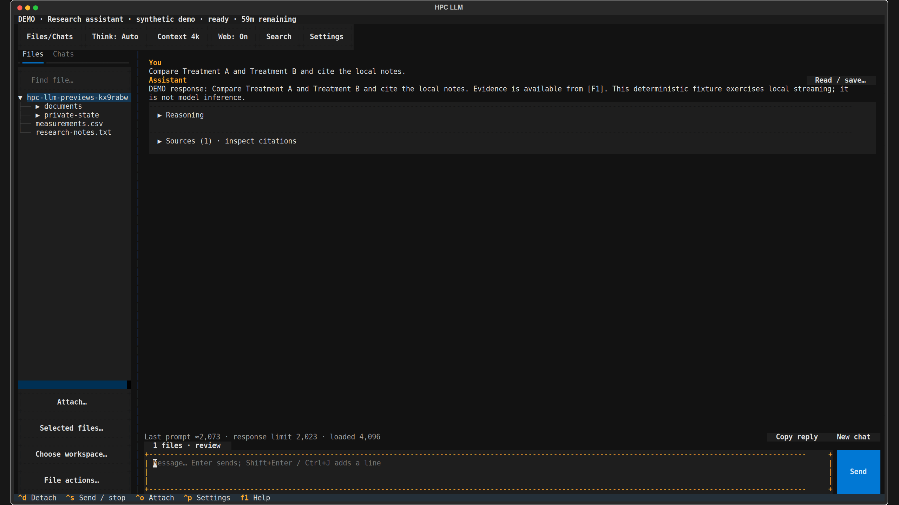
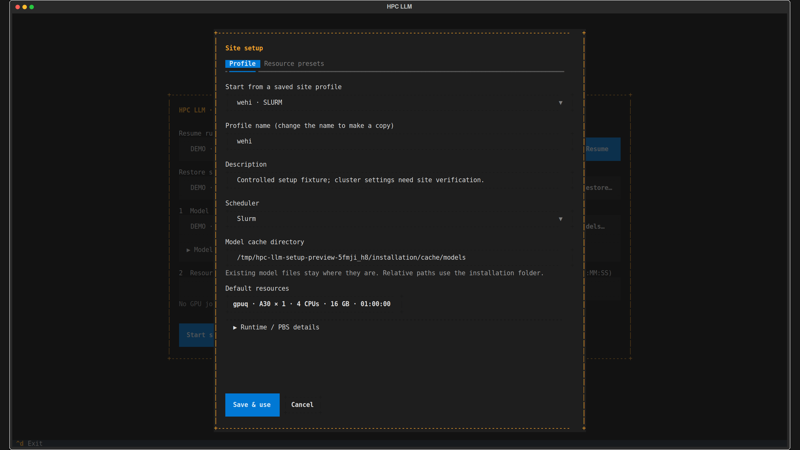
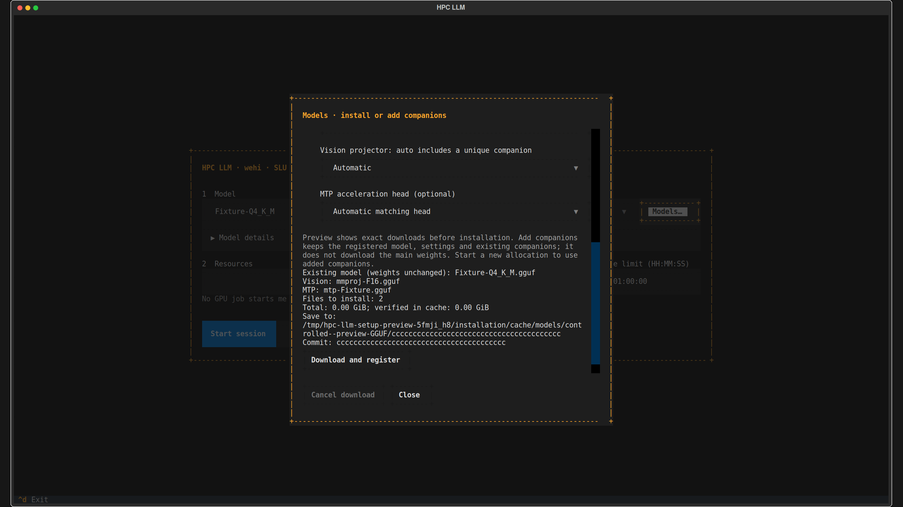
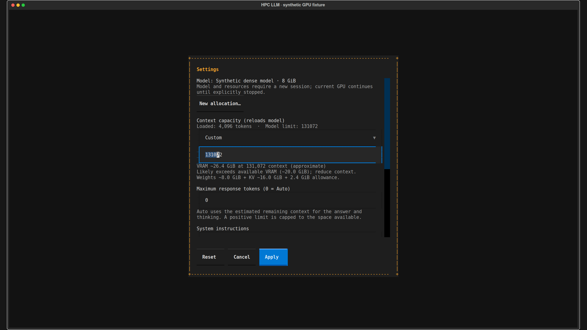
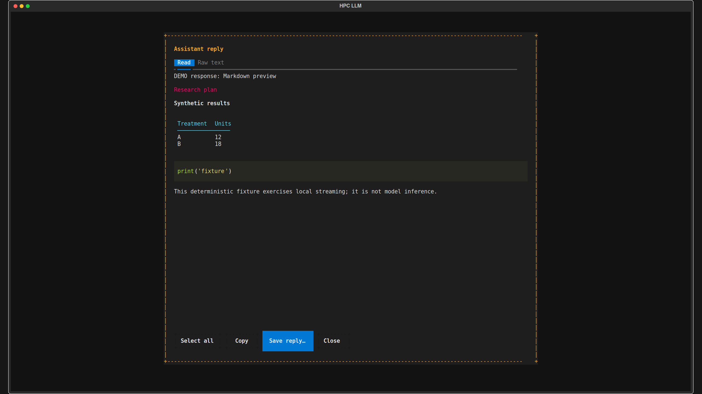

# HPC Llama

Run local GGUF models on a cluster GPU. Use a terminal interface to chat, read files, and search the web. Detach and reconnect while the model stays loaded.

The application uses llama.cpp in a persistent Slurm or PBS allocation. Slurm sessions use an attachable `srun` terminal. The batch job owns the model process.



## Install

Run these commands on your cluster's **Linux login node**. Keep the application folder on retained project or home storage. Login and compute nodes must share this path.

```bash
git clone https://github.com/CubeJerry/hpc-llama.git
cd hpc-llama
bash install.sh --profile wehi
./hpc-llm --check
./hpc-llm
```

Use `./hpc-llm` from this folder. Installation does not add the command to your shell's `PATH`.

The installer supplies private Python, application libraries, llama.cpp, and CUDA user-space libraries. It does not load system modules or download model weights. Keep the installed folder at the same path. If you move it, run the installer again at the new path.

**Host requirements:** Linux x86_64, Bash, `curl`, `tar`, `sha256sum`, and scheduler commands. The default CUDA runtime requires glibc 2.28 or later and a compatible NVIDIA driver on the compute node. Git is needed for the clone command. A macOS or Windows terminal can connect to the cluster through SSH; installation runs on the cluster.

Choose another starting profile if needed:

```bash
bash install.sh --profile generic   # Slurm
bash install.sh --profile pbs       # PBS Pro / OpenPBS
```

For a CPU-only installation, add `--backend cpu`. After installation, `./hpc-llm --demo` opens a simulated session without a scheduler, model download, or internet access.

## Configure your site once

Open **Site setup…** in the launcher. Select the scheduler. Enter your site's partition or queue, GPU type, account, and default resources. Select **Save & use**. Add named presets for resource combinations you use often.

The bundled `wehi`, `generic`, and `pbs` profiles are starting points. Check their values against your cluster access. The WEHI defaults request one A30 on `gpuq`, four CPUs, 16 GB of system RAM, and one hour.



You can also import a JSON profile. Save the following example as `mysite.json` in the application folder. Replace the resource values with those for your site.

```json
{
  "name": "mysite",
  "description": "My cluster GPU resources",
  "scheduler": "slurm",
  "resources": {
    "partition": "gpu",
    "gpu_type": "A100",
    "gpu_count": 1,
    "cpus": 8,
    "memory_gb": 32,
    "walltime": "04:00:00",
    "account": "",
    "qos": "",
    "constraint": ""
  },
  "resource_presets": {},
  "model_cache": "cache/models",
  "runtime": ""
}
```

```bash
./hpc-llm profiles use ./mysite.json
./hpc-llm profiles show
```

Import creates a managed copy at `state/profiles/mysite.json`. Edit that copy later, or use **Site setup…**. Each profile has its own name; there is no required file named `profile.json`. `state/config.json` stores the active profile and any model-cache override.

| Field | What to enter |
|---|---|
| `name` | A unique name. Use letters, numbers, underscores, or hyphens. |
| `scheduler` | `slurm` or `pbs`. |
| `partition` | Your Slurm partition or PBS queue. |
| `gpu_type` | The GPU resource label used by your site. Leave blank if the site does not require one. |
| `gpu_count` | Set to `1`. This release supports one GPU on one node for Slurm and PBS. |
| `cpus` | The number of CPU cores to request. |
| `memory_gb` | **System RAM**, in GB. This does not set GPU VRAM. |
| `walltime` | Default time limit, such as `04:00:00`. |
| `account` | Your allocation account, if required. Otherwise leave blank. |
| `qos`, `constraint` | Optional Slurm settings. Leave blank for PBS. |
| `resource_presets` | Named resource combinations. Use Site setup to add them. |
| `model_cache` | Folder for downloaded weights. Relative paths start from the application folder. |
| `runtime` | Leave blank to use the installed llama.cpp runtime. |

Profile paths expand `~` and environment variables such as `$USER`. User profiles override bundled profiles with the same name. If you set `HPC_LLM_HOME`, user profiles and configuration use that state folder instead.

**PBS:** start from the bundled `pbs` profile. Set `pbs_gpu_resource`, the optional `pbs_gpu_type_resource`, and `pbs_attach_command` for your site. PBS requires `qsub`, `qdel`, `qstat -fx -F json`, retained job history, and `pbs_attach`. Attaching also requires non-interactive SSH to the allocated host with normal host-key verification. These requirements need site validation. Other workload managers are not supported.

## Choose the model cache

The WEHI profile uses `/vast/scratch/users/$USER/llama_cache`. The generic and PBS profiles default to `cache/models` inside the application folder. To choose another location:

```bash
./hpc-llm profiles cache '/vast/scratch/users/$USER/llama_cache'
./hpc-llm profiles show
```

You can also pass `--cache-dir PATH` to `install.sh`. This option changes the model location only. Python, libraries, and the runtime stay in the application folder.

Cache selection follows this order: `HPC_LLM_MODEL_CACHE`, then `state/config.json`, then the selected profile, then `cache/models`. A saved global override stays active when you change profiles. Unset `HPC_LLM_MODEL_CACHE` if you want the saved setting to apply.

The application creates a missing cache folder. It retains existing files and reports an unwritable path. It does not silently choose another folder. Registered local weights stay at their original paths.

## Install or register a model

Select **Add model** and paste a Hugging Face repository or model URL. Choose the quantization, then review the download plan. The command-line equivalent is:

```bash
./hpc-llm models install unsloth/Qwen3.8-27B-GGUF --quant UD-Q4_K_XL --dry-run
./hpc-llm models install unsloth/Qwen3.8-27B-GGUF --quant UD-Q4_K_XL
```

Replace the repository and quantization with your choice. The installer selects one main quantization and an unambiguous matching vision projector. If several companion files match, specify an exact filename. It verifies downloaded files and registers them. Model support also depends on the installed llama.cpp runtime.

Already have the weights? Register them without copying or downloading:

```bash
./hpc-llm models register /absolute/path/model.gguf
# Include a matching vision projector when available:
./hpc-llm models register /absolute/path/model.gguf --projector /absolute/path/mmproj.gguf
./hpc-llm models list
```

### Add vision or MTP later

In **Add model**, select the registered model as the update target. Expand **Vision / acceleration and revision** to select its companions. Or run:

```bash
./hpc-llm models install --model /absolute/path/model.gguf \
  --projector auto --mtp auto --dry-run
```

Remove `--dry-run` after you review the plan. This update downloads companions only. It preserves the main weights, model identity, and saved settings. For a manually registered model, also supply its original `OWNER/REPOSITORY`. Use exact companion filenames if `auto` is ambiguous. The main weights must match that repository.



Start a **new GPU session** after you add companions. A running session keeps its original model configuration.

Enable MTP in **Advanced → Acceleration**. **Auto** uses MTP when the model and runtime report support. Explicit **MTP** reports an error if requirements are missing. Some models contain MTP layers; others need a compatible head. MTP can use more VRAM, and it does not guarantee faster generation.

Unchanged, previously verified files reuse their checksum result. New or changed files receive a full check. Select **Full checksum recheck**, or add `--verify-full`, to read every byte again.

## Start, detach, and reconnect

1. Select a registered model in the launcher.
2. Set **Time limit** for this allocation. Open **Resources** to change the GPU, system RAM, CPUs, partition, or preset.
3. Select **Start session**. The scheduler may queue the request before the model loads.

Launch changes apply to that allocation only. You do not need to edit or reinstall the profile each time. You cannot change an existing allocation's expiry through the app.

**Detach** closes the terminal view and leaves the allocation running. It continues to use allocated GPU time. Open `./hpc-llm` and select **Resume** to reconnect to a running session. **Restore saved chats** starts a new allocation for a saved session. **Stop GPU session** releases the allocation.

```bash
./hpc-llm sessions
./hpc-llm attach
./hpc-llm stop SESSION_ID
```

## Use the chat interface

| Control | Behavior |
|---|---|
| Message box | Enter sends. Shift+Enter or Ctrl+J adds a line. Use your terminal's paste command. |
| **Think** | Shows the thinking controls reported by the loaded model template. Options vary by model. |
| **Context** | Sets context capacity and output budget. A capacity change reloads the model in the same allocation. |
| **Web** | Enables external searches and page requests for the session. Per-request approval is optional. |
| **Advanced** | Holds temperature, sampling parameters, acceleration, and other detailed settings. |
| **New chat** | Starts with empty context and retains the previous chat. Ctrl+N is the shortcut. |
| **Read / save…** | Opens a readable response, selectable raw text, and Markdown or text export. |

Set the maximum output to **0** for automatic use of the estimated remaining context. A positive value is a ceiling, capped to the remaining space. Input, thinking, and output share the context window. A full prompt still requires a new chat, less input, or a larger context.

Context settings show a **VRAM estimate** as you type. The indicator uses backend measurements where available, with a supported-model metadata fallback. It warns near or above the observed GPU budget. Unknown configurations remain unknown. Estimates cannot guarantee a fit, especially with images, MTP, partial offload, or multiple GPUs.



### Files, web sources, and outputs

Choose **Workspace** for local inputs and saved outputs. This path is on the cluster. Transfer files through Open OnDemand Files, SCP, or SFTP before attaching them.

Read TXT, Markdown, CSV/TSV, JSON, DOCX, Excel `.xlsx`, and selectable PDF text. File citations identify the source location. Excel processing reads saved values; it does not recalculate formulas. PDF processing does not perform OCR. PNG, JPEG, and WebP analysis requires a vision-capable model and its matching projector.

Web search and page retrieval provide source citations. They require compute-node internet access and an available provider. **Web On** permits external queries until you turn it off. File processing and model inference run on the cluster.

Ask the model to create a Markdown or text file in the selected workspace. Use **Read / save…** to save an individual reply. The app does not generate updated PDFs or Excel workbooks. Clipboard transfer depends on your terminal and connection.



The previews use a 200-column × 56-row terminal at 2560 × 1440 pixels. Your font size and display scaling change the visible proportions. [All preview pictures](assets/).

## Check a real cluster

Start with an existing small GGUF model. Inspect the request before you allocate a GPU:

```bash
./hpc-llm --check
./hpc-llm doctor
./hpc-llm smoke --model /absolute/path/small-model.gguf
```

The smoke command uses the selected profile and a 20-minute time limit. It prints the batch request without submitting it. After you check the resources, repeat with `--execute`:

```bash
./hpc-llm smoke --model /absolute/path/small-model.gguf --execute
```

Check a short reply, GPU offload diagnostics, detach and resume, a context change, and a synthetic file attachment. Test web access and vision separately if needed. Stop the session after the check. Cloud fixtures do not validate WEHI permissions, GPU inference, VRAM estimate accuracy, or terminal behavior.

## Update and retain your data

Stop active GPU sessions before updating:

```bash
git pull --ff-only
bash install.sh
./hpc-llm
```

Reinstallation preserves the selected profile and cache unless you explicitly change them. Keep `state/` for profiles, model registrations, and saved chats. Keep your workspace for inputs and outputs.

If scratch cleanup deletes only model weights, run `models install` again. Restore the projector and MTP head too, if used. You do not need to reinstall the application or recreate the profile. If cleanup deletes the application or `state/`, those components must also be restored.
